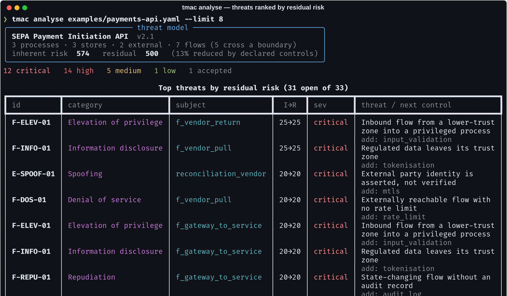
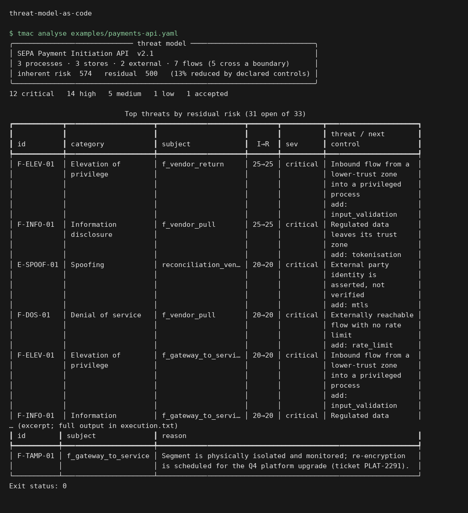
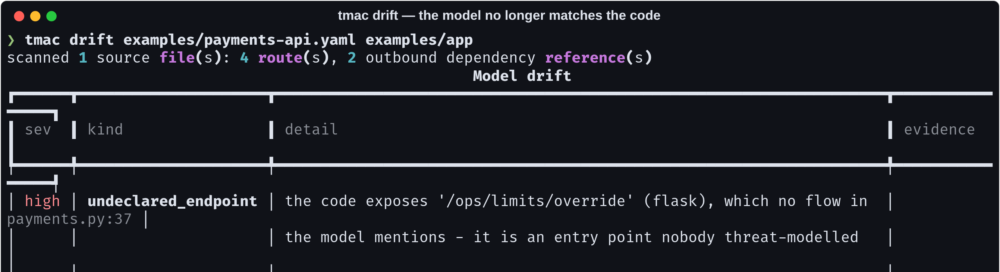
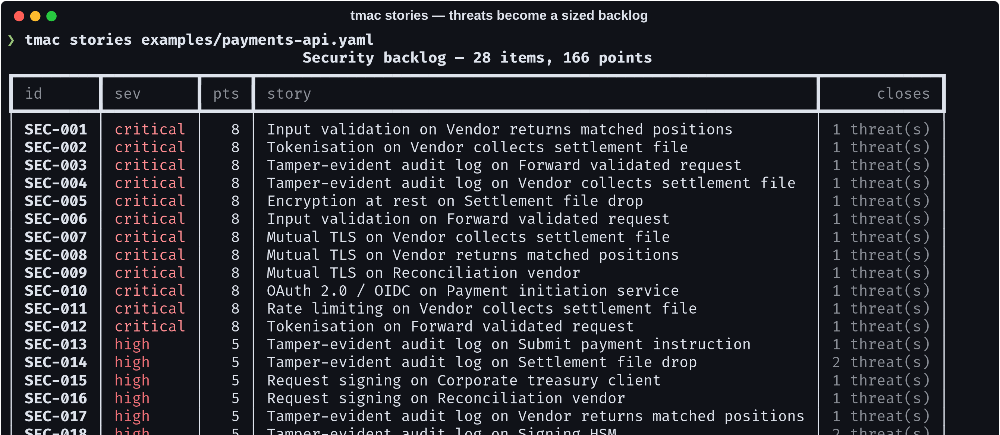
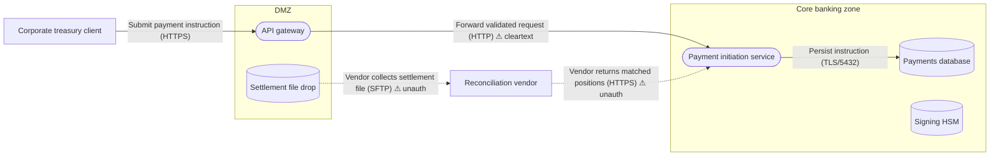
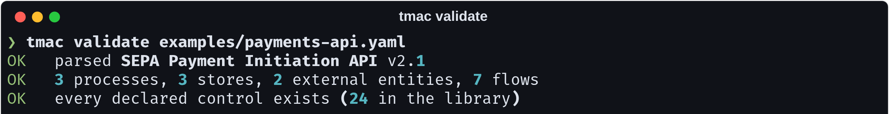

# threat-model-as-code

> Threat models die of drift. Six months after the workshop, three endpoints
> have been added and the diagram in the wiki describes a system that no longer
> exists — while still reporting a comfortable risk score. This one fails CI
> when that happens.

[](https://github.com/Vincent-P-essy/threat-model-as-code/actions/workflows/ci.yml)
[](pyproject.toml)
[](tests)
[](src/tmac/stride.py)
[](src/tmac/stride.py)
[](LICENSE)

Describe a system in YAML. Get STRIDE threats enumerated **conditionally**
against it, scored with a model you can argue with, rendered as a Mermaid
data-flow diagram, turned into a sized backlog — and checked against the actual
source tree so the model cannot quietly rot.



## Execution preview



Local execution of `tmac analyse examples/payments-api.yaml`. The input and output shown come from the repository example or test fixtures. [Verification](docs/verification.md).

## Why the output is short

Most threat-model generators emit all six STRIDE categories for every element.
Eight elements gives you 48 findings that all look the same, the team skims
them once, and the exercise is never repeated.

Every rule here carries a **predicate over the model**:

```python
Rule(
    "F-SPOOF-01", Stride.SPOOFING, (ElementKind.FLOW,),
    "Unauthenticated flow across a trust boundary",
    ...,
    condition=lambda flow, model: not flow.authenticated and model.crosses_boundary(flow),
)
```

A threat appears when the model says its preconditions hold, and stays quiet
otherwise. The example model — 8 elements, 7 flows — produces 33 threats, of
which 12 are critical and one is a recorded acceptance. That is a list somebody
reads.

## Scoring you can argue with

Every number traces to something in the model, and each threat records why it
moved:

- **Impact** starts at the rule's base and rises to the weight of the most
  sensitive data involved. The same flaw on `public` data and on `secret` data
  are not the same finding.
- **Likelihood** rises when the model says the attack is easier — the flow
  crosses a boundary, or nothing authenticates it.
- **Residual** applies the controls the model declares, with **capped stacking**
  (85%). Without a cap, any model scores zero by listing every control in the
  library, and a scoring system people can game is one they will.

Inherent *and* residual are both reported: inherent alone ignores the work
already done, residual alone hides how much is riding on a single control.

Severity thresholds are deliberately high (critical ≥ 20 of 25). A
boundary-crossing flow carrying PII reaches 16 without anything being
especially wrong with it, so a lower bar paints two thirds of a realistic model
red — and a report where everything is critical ranks nothing.

## Accepting a risk is a decision, so it needs a reason

```yaml
accepted:
  F-TAMP-01: >-
    Segment is physically isolated and monitored; re-encryption is scheduled
    for the Q4 platform upgrade (ticket PLAT-2291).
```

The loader **rejects** an acceptance with no reason. Accepted threats leave the
open count and appear in their own section of the report, with the reason
attached. Accepting risk is legitimate; doing it silently is how it stops being
a decision.

## The drift check



`tmac drift` walks the source tree, extracts entry points and outbound
dependencies, and compares them against what the model declares. The example
app deliberately exposes `/ops/limits/override` — an endpoint "added during an
incident, never modelled" — and the check finds it, with the file and line.

Run in CI, it turns "the model is stale" from something nobody notices into a
failing check on the pull request that made it stale.

**What it can and cannot see**, because a drift checker that guesses produces
false positives and a check people learn to ignore is worse than no check:

- It reads route decorators (Flask, FastAPI, Express, Django), client
  constructions and connection strings. Everything it reports has a file and a
  line.
- It cannot see a flow that only exists at runtime through configuration, and
  does not try.
- Credentials found in connection strings are redacted before they reach the
  report — drift output gets pasted into pull requests.

One test in this repo exists because the scanner originally reported *itself*:
`mysql://` appears in its own pattern table. Any regex-based scanner has this
bug, and there is now a guard and a test for it.

## From threats to work someone will actually do



Stories group **by control and subject**, not by threat — eleven threats
answered by "add mutual TLS on the vendor boundary" are one piece of work.
Acceptance criteria are written to be checkable:

```markdown
### SEC-007 — Mutual TLS on Vendor collects settlement file

**As a** platform engineer, **I want** both ends to present certificates…

**Acceptance criteria**
  - [ ] a request presenting no client certificate is rejected with 403
  - [ ] a request presenting a certificate signed by an untrusted CA is rejected
  - [ ] the peer certificate subject appears in the request log
```

Not "ensure the endpoint is secure", which cannot be closed. A test asserts no
criterion contains the words *secure*, *properly*, *as appropriate* or *best
practice*.

## Diagrams that cannot go stale

Mermaid, generated from the same model, so GitHub renders it inline in the pull
request that changed it:



Unauthenticated flows are dashed, so the eye finds them before it reads a
label. `--risk` shades elements by residual severity for the review meeting;
plain is for the architecture page, because a diagram where everything is red
communicates nothing.

## Install and run

```bash
git clone https://github.com/Vincent-P-essy/threat-model-as-code
cd threat-model-as-code
pip install -e .

tmac analyse examples/payments-api.yaml
tmac drift   examples/payments-api.yaml examples/app
tmac stories examples/payments-api.yaml --out backlog.md
tmac diagram examples/payments-api.yaml --risk
tmac rules
```



`tmac validate` also catches the failure mode that is otherwise silent: a
**typo'd control id**. `contols: [tls]` means "no mitigation", which quietly
inflates the residual score with no error anywhere. It fails the build instead.

## Writing a model

```yaml
name: SEPA Payment Initiation API
boundaries:
  - { id: internet, name: Public internet }
  - { id: core,     name: Core banking zone }
elements:
  - id: payment_service
    kind: process              # process | store | flow | external
    boundary: core
    data: [pii, confidential]  # public | internal | confidential | pii | secret
    controls: [input_validation, rbac, audit_log]
flows:
  - id: f_vendor_return
    source: reconciliation_vendor
    target: payment_service
    data: [confidential]
    authenticated: false       # this is what makes the threats appear
    encrypted: true
```

`tmac rules` lists all 19 rules with the conditions that fire them and the
controls that close them.

## Gating a pipeline

```bash
tmac analyse model.yaml --fail-over critical    # exit 1 on an unaccepted critical
tmac drift   model.yaml ./src --strict          # exit 1 on any drift
```

Both default to off. A check that starts failing builds the day it is installed
gets removed the same week.

## Where this stops

- **Scoring is a heuristic, not actuarial.** It ranks; it does not predict.
  Read the ordering, not the absolute numbers.
- **Rules are hand-written.** 19 of them, covering all six STRIDE categories
  across four element kinds. A domain with its own attack patterns needs its
  own rules, which is why they are data-shaped.
- **The drift scanner is regex-based.** Deliberately: an AST-based scanner per
  language would find more and also invent more.
- **It models what you tell it.** A component nobody declared generates no
  threats — which is exactly why the drift check exists.

## Layout

```
src/tmac/
  model.py    YAML schema, validation, trust-boundary logic
  stride.py   19 conditional rules · 24 controls
  engine.py   scoring, inherent vs residual, severity bands
  diagram.py  Mermaid data-flow diagrams
  stories.py  backlog generation with checkable acceptance criteria
  drift.py    source-tree scanner and comparison
  report.py   terminal and markdown
examples/
  payments-api.yaml   a bank payments API, with one accepted risk
  app/payments.py     the service, with one endpoint the model never heard of
```

## Licence

MIT
